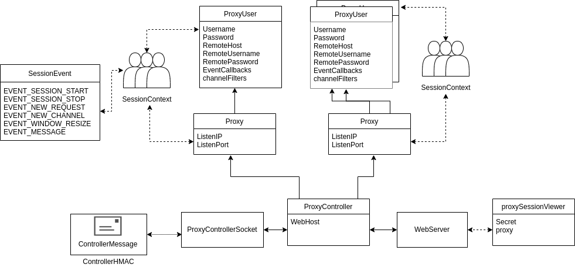

# SSH Proxy+

## Purpose
The goal of this project is to create an ssh proxy that can provide real-time logging,
mirroring, and monitoring of ssh sessions as they occur. 

## What is it? 

The primary components of this library are depicted below. 




* Proxy - the proxy has a ListenIP and ListenPort that it listens on for SSH clients. 
The client authenticates with a username and password; the Proxy matches that to a corresponding
ProxyUser that is configured for the proxy. The client is then connected to the remote host for
that ProxyUser. There is also an option to allow all authentication requests and to forward
them to a default remote server.

* ProxyUser - the ProxyUser has the Username and Password required to authenticate, the RemoteHost to connect
to, the RemoteUsername and RemotePassword to use with the RemoteHost, and a list of EventCallbacks
and channelFilters to use on an any events that occur in any sessions that occur. 

  * EventCallbacks are non-blocking anonymous functions that can be called when an event occurs
  * EventFilters are blocking anonymous functions that process message events and return 
processed data. 

* SessionContext - a SessionContext is created when a new user authenticates to a proxy. It is used to track everything
associated with a given session. Every event that occurs is stored in memory and is also written
to disk in JSON. 

* ProxyController - This is both an API to create and manage proxies, as well as a socket interface for
a remote client to manage the controller. A remote client is given a preshared key that can be used
to send HMAC-signed messages to configure the proxy. 

* WebServer - the ProxyController WebServer is an http server that provides web browsers with the ability to
view live and replays of sessions. There are two modes:
  * the WebServer can be configured to make all sessions visible; 
  * alternatively, a client can provide a ProxyID and a Secret to connect to a proxySessionViewer that corresponds to
  a ProxyUser for a given proxy. These can be either tied to a single session, or to all sessions for that user. 


## Demo:

You can view a live proxy WebServer and Proxy running at https://proxy.jianmin.dev/

## Dependencies

For xterm.js to work, you'll need to pull 
down the source files. 

Go to html/js and run:

```
npm install --save xterm
npm install --save xterm-addon-fit
```

For me, on stock Ubuntu server 20.04, this places the xterm source in:

`html/js/node_modules/xterm/` 

and

`html/js/nod_modules/xterm-addon-fit/`


## Usage:

### Launching Go Server

```
go mod tidy
go run .
```

For usage:

```
go run _example/sshproxyplus.go --help
```

Tests:

```
go test -cover
```

### Launching Static HTML server (for replays)

``` 
cd html
python3 -m http.server
```


## Supported Channel Types:

* exec
* tty

## Unsupported Channel Types:

* tunnels. not the goal of this project

## References

* https://www.ssh.com/academy/ssh/protocol#the-core-protocol
* https://blog.gopheracademy.com/advent-2015/ssh-server-in-go/
* https://scalingo.com/blog/writing-a-replacement-to-openssh-using-go-12
* https://github.com/helloyi/go-sshclient/blob/master/sshclient.go
* https://gist.github.com/denji/12b3a568f092ab951456


